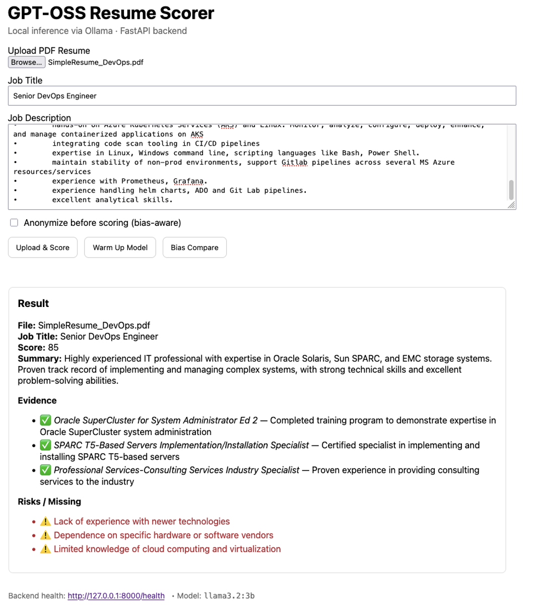
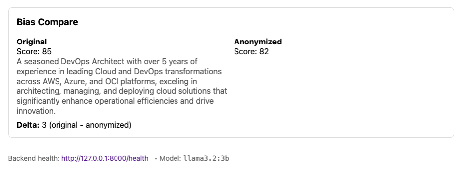

# GPT-OSS Resume Scorer 📝⚡


---

# GPT-OSS Resume Scorer 📝⚡

**AI-powered Resume Scoring & Bias-Aware Comparison**  
Built with **FastAPI + React + Ollama (llama3.2:3b)**

---

## 🚀 Overview
Hiring processes often rely on automated resume screeners — but they can be biased, opaque, or slow.  
Our **GPT-OSS Resume Scorer** solves this by providing:

- **Fast local inference** (via [Ollama](https://ollama.ai/))  
- **Explainable scoring** of resumes vs job descriptions  
- **Bias-aware anonymization** & side-by-side comparison  
- **Fair, transparent outputs** with evidence and missing skills

This project was built for the **Hackathon** to demonstrate how OSS AI can empower **ethical recruitment**.

---

## ✨ Features
- **Upload & Score**: Upload a PDF resume and compare it with a job description.
- **Explainability**: See not just a score, but also:
  - ✅ **Evidence** (skills & experiences found)  
  - ⚠️ **Risks / Missing** (gaps relative to the job description)  
- **Bias Compare**:
  - Compare **original** vs **anonymized** resumes (removing names, emails, phone, etc.)
  - Detect potential bias if anonymized scores differ.
- **Warmup Button**: Preloads the model so judges won’t wait for cold start.

---

## 🖼️ Screenshots

### Upload & Score


### Bias Compare


---

## 🛠️ Tech Stack
- **Frontend**: React + Vite  
- **Backend**: FastAPI (Python)  
- **AI Inference**: Ollama (llama3.2:3b, local model)  
- **PDF Parsing**: PyMuPDF (`fitz`)  
- **Environment Config**: dotenv  

---

## ⚡ Quickstart - Instructions

0) Prereqs

• Ollama running with llama3.2:3b pulled:
```bash
ollama pull llama3.2:3b
```
• Python 3.10+, Node 18+, Homebrew (macOS)  
• Repo cloned locally

1) Start Backend (FastAPI)
```bash
cd backend
python -m venv venv
source venv/bin/activate
pip install -r requirements.txt
```
# Run backend
```bash
python -m uvicorn backend.main:app --reload --reload-dir backend
```
Health check:
```bash
curl -s http://127.0.0.1:8000/health | jq .
```
Warm up models (avoids first-run latency):
```bash
curl -s -X POST http://127.0.0.1:8000/resume/warmup | jq .
```
2) Quick Curl Demo (No Frontend)

A) Score a Resume vs Job Description

Use any PDF. Example uses ~/sample_resume.pdf.
```bash
curl -s -X POST http://127.0.0.1:8000/resume/upload \
  -F "file=@$HOME/sample_resume.pdf;type=application/pdf" \
  -F "job_title=Senior DevOps Engineer" \
  -F "job_description=5+ years Linux, CI/CD, Docker/K8s, IaC with Terraform, cloud (AWS/Azure), monitoring, security basics." \
  -F "anonymize=true" | jq .
```
B) Bias Compare (Original vs Anonymized)
```bash
curl -s -X POST http://127.0.0.1:8000/resume/compare \
  -F "file=@$HOME/sample_resume.pdf;type=application/pdf" \
  -F "job_title=Senior DevOps Engineer" \
  -F "job_description=5+ years Linux, CI/CD, Docker/K8s, IaC with Terraform, cloud (AWS/Azure), monitoring, security basics." | jq .
```
Tip: For a super-fast smoke test without a PDF, you can also pass a .txt file:
```bash
printf "DevOps engineer with Kubernetes, Terraform, AWS.\n" > /tmp/resume.txt
curl -s -X POST http://127.0.0.1:8000/resume/upload \
  -F "file=@/tmp/resume.txt;type=text/plain" \
  -F "job_title=Senior DevOps Engineer" \
  -F "job_description=Kubernetes, Terraform, AWS" | jq .
```
3) Start Frontend (React)
```bash
cd frontend
npm install
# If your backend is not the default base URL, set VITE_API_BASE
# e.g., echo 'VITE_API_BASE="http://127.0.0.1:8000"' > .env
npm run dev
```
Open: http://localhost:5173

UI Flow -
1. Click Choose File → pick a PDF resume.  
2. Enter Job Title and paste a Job Description.  
3. (Optional) Check Anonymize.  
4. Click Upload & Score → see Score, Summary, Evidence, Risks.  
5. Click Bias Compare → see Original, Anonymized, and Delta.  

4) Environment Variables (optional)

You can override model or CORS in .env (repo root):
```bash
MODEL=llama3.2:3b
MODEL_COMPARE=llama3.2:3b
OLLAMA_URL=http://127.0.0.1:11434
BACKEND_CORS_ORIGINS=http://localhost:5173,http://127.0.0.1:5173
```
5) Troubleshooting

• Slow first response: run POST /resume/warmup first.  
• Upload times out: ensure the PDF path is simple (no spaces/special chars) and size <10MB.  
• Bias Compare shows delta 0: try a different resume or JD; anonymization removes identity/locations, but if content is identical, scores may match.  

• Ollama connection issues: verify the daemon is listening:   
```bash
curl -s http://127.0.0.1:11434/api/version | jq .
curl -s http://127.0.0.1:11434/api/tags | jq .
```
• Mac M1 Pro / 16 GB: this project is tuned for llama3.2:3b. Heavier models may time out.
